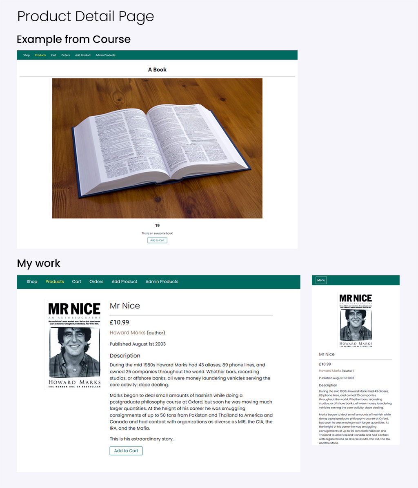
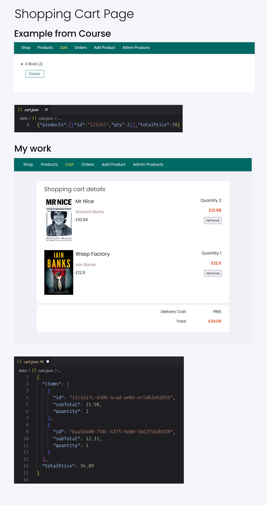

## NodeJS The Complete Guide (MVC, REST APIs, GraphQL, Deno)
#### Taught by Maximilian Schwarzmüller (Udemy/Academind)

### Description
An extensive Node JS course covering Express, REST APIs with Node, GraphQL APIs, Authentication, MongoDB, SQL and Deno.js.

### Current Progress: Section 9 - Dynamic Routes.
I have added CRUD functionality to the shopping cart, working with routes, controllers, models and EJS templates.

The focus of the course is obviously the programming, rather than appearance. I have tried to do a little more with both, as hopefully the following two images illustrate.

#### Product detail Page

#### Shopping Cart Page

Here is a deployed demo of where I am so far.
https://node-js-complete-guide.herokuapp.com/products